# MLP Ratio Ablation: End-to-End Guide

_Prepare the environment, download FineWeb, train the tokenizer, run the ablation study, and generate the result figure locally or on a server. Last verified: 2026-07-12._

---

## 📋 Project overview

This project compares four Transformer MLP expansion ratios: `2x`, `4x`, `6x`, and `8x`. All four experiments use the same model depth, hidden dimension, dataset, random seed, and training-token budget. The only intended difference is the MLP intermediate width:

```text
hidden state d -> Linear(d, ratio*d) -> ReLU² -> Linear(ratio*d, d)
```

The default settings are defined in [`spec.py`](./spec.py), the model variants in [`trunk.py`](./trunk.py), the experiment entry point in [`run.py`](./run.py), and the plotting entry point in [`plot.py`](./plot.py).

```mermaid
flowchart LR
    accTitle: MLP Ratio Ablation Workflow
    accDescr: End-to-end workflow from environment setup and FineWeb download through tokenizer training, four MLP ratio arms, result collection, and plotting

    prepare_env([Prepare Python and CUDA]) --> download_data[Download FineWeb data]
    download_data --> train_tokenizer[Train shared tokenizer]
    train_tokenizer --> verify_inputs{Inputs valid?}
    verify_inputs -->|No| repair_inputs[Repair data or tokenizer]
    repair_inputs --> verify_inputs
    verify_inputs -->|Yes| run_arms[Run 2x 4x 6x 8x]
    run_arms --> collect_results[Write curves.json]
    collect_results --> plot_results([Generate result figure])

    classDef process fill:#dbeafe,stroke:#2563eb,stroke-width:2px,color:#1e3a5f
    classDef decision fill:#fef9c3,stroke:#ca8a04,stroke-width:2px,color:#713f12
    classDef success fill:#dcfce7,stroke:#16a34a,stroke-width:2px,color:#14532d

    class prepare_env,download_data,train_tokenizer,repair_inputs,run_arms,collect_results process
    class verify_inputs decision
    class plot_results success
```



> ⚠️ **Important:** The contents of `datasets/`, `models/`, and `outputs/` are excluded by `.gitignore`. Uploading or cloning the Git repository does not include the parquet data or `tokenizer.pkl`.

## 🧰 Prerequisites

| Resource | Requirement | Verification command |
| --- | --- | --- |
| Python | `>=3.12` | `python --version` |
| GPU | CUDA-capable; Linux server recommended | `nvidia-smi` |
| PyTorch | Must detect CUDA | See the command below |
| Storage | Enough for FineWeb parquet files and run artifacts | `df -h` |
| Network | Access to Hugging Face or a working mirror | `curl -I https://huggingface.co` |

Run the following commands from the repository root:

```bash
cd /path/to/nanoinfra-main

python --version
nvidia-smi
python -c "import torch; print('torch:', torch.__version__); print('CUDA:', torch.version.cuda); print('available:', torch.cuda.is_available()); print('GPU:', torch.cuda.get_device_name(0) if torch.cuda.is_available() else 'none')"
```

A working CUDA environment should print `available: True`. Model training requires CUDA. Tokenizer training primarily uses the CPU, so it can run on a local machine without a GPU.

### Install Python dependencies

If the current Python environment can already use CUDA, do not reinstall the CUDA Toolkit. Install only the project and the additional utilities:

```bash
python -m pip install -U pip
python -m pip install -e .
python -m pip install pyarrow matplotlib tqdm
```

Verify the key dependencies:

```bash
python -c "import torch, hydra, pyarrow, rustbpe, tiktoken, tqdm; print('dependencies OK')"
```

## 📊 Download the FineWeb experiment data

The repository script [`download_shards.py`](../../exemplars/text_pretrain/data/download_shards.py) downloads `sample/10BT` parquet shards from the `HuggingFaceFW/fineweb` dataset. FineWeb is public and does not require a Hugging Face access token.[^1]

### Minimum runnable dataset

Prepare at least two shards. The first shard is used for training, and the last shard in sorted order is used for validation.

```bash
mkdir -p outputs/base_data
python -u exemplars/text_pretrain/data/download_shards.py 000 001
```

Expected directory layout:

```text
outputs/base_data/
├── shard_000_00000.parquet
└── shard_001_00000.parquet
```

### More complete dataset configuration

The configuration described by the project README uses six shards: the first five for training and the last one for validation.

```bash
python -u exemplars/text_pretrain/data/download_shards.py \
  000 001 002 003 004 005
```

The current `20M tokens` smoke test can start with shards `000` and `001`. Download more shards before increasing the training budget substantially.

### Resolve Hugging Face connection failures

The following errors indicate that the server or container cannot connect to Hugging Face correctly:

```text
[Errno 99] Cannot assign requested address
RuntimeError: Cannot send a request, as the client has been closed.
```

Test the official endpoint and the mirror first:

```bash
curl -I --connect-timeout 15 https://huggingface.co
curl -I --connect-timeout 15 https://hf-mirror.com
```

If the official endpoint is unreachable but the mirror works:

```bash
export HF_ENDPOINT=https://hf-mirror.com
export HF_HUB_DISABLE_XET=1
export HF_HUB_ETAG_TIMEOUT=60
export HF_HUB_DOWNLOAD_TIMEOUT=600

python -u exemplars/text_pretrain/data/download_shards.py 000 001
```

If the Python client still fails, update its networking packages:

```bash
python -m pip install -U huggingface_hub httpx
```

The shards can also be downloaded directly through the mirror:

```bash
mkdir -p outputs/base_data

wget -c \
  "https://hf-mirror.com/datasets/HuggingFaceFW/fineweb/resolve/main/sample/10BT/000_00000.parquet" \
  -O outputs/base_data/shard_000_00000.parquet

wget -c \
  "https://hf-mirror.com/datasets/HuggingFaceFW/fineweb/resolve/main/sample/10BT/001_00000.parquet" \
  -O outputs/base_data/shard_001_00000.parquet
```

> ⚠️ **Note:** The mirror is an alternative network endpoint and is not part of this project. If both endpoints are unreachable, download the files on another machine and transfer them with `scp`, `rsync`, or the server provider's upload facility.

### Verify parquet integrity

```bash
ls -lh outputs/base_data/*.parquet

python -c "import glob, pyarrow.parquet as pq; [(print(f, pq.ParquetFile(f).metadata.num_rows)) for f in glob.glob('outputs/base_data/*.parquet')]"
```

Every file should report a positive row count. If `pyarrow` cannot open a file, download that shard again instead of continuing with a damaged file.

## 🔧 Train the project tokenizer

[`modalities/text/tokenizer.py`](../../modalities/text/tokenizer.py) provides the tokenizer classes and training interface, but it is not a trained vocabulary. The required artifact is:

```text
outputs/tokenizer/tokenizer.pkl
```

This repository includes an executable training script at [`scripts/train_tokenizer.py`](../../scripts/train_tokenizer.py). It performs the following operations:

- Streams documents from the parquet `text` column
- Excludes the last sorted shard reserved for validation
- Trains a RustBPE tokenizer
- Creates a total vocabulary of `50,304` tokens
- Appends `18` control tokens in the required order
- Validates the control-token ID layout before saving

### Run tokenizer training

```bash
python -u scripts/train_tokenizer.py \
  --data-dir outputs/base_data \
  --output-dir outputs/tokenizer \
  --max-documents 1000000
```

Tokenizer training primarily uses the CPU. For a quick pipeline test, reduce `--max-documents` to `100000`. All four formal experiment arms must share the same tokenizer; do not train a separate tokenizer for each arm.

Expected successful output:

```text
[done] saved .../outputs/tokenizer/tokenizer.pkl
[done] vocabulary size: 50,304
[done] special tokens: 18
```

### Verify the tokenizer

```bash
python -c "from modalities.text import get_tokenizer; t=get_tokenizer(); print('vocab:', t.get_vocab_size()); print('specials:', len(t.get_special_tokens()))"
```

Expected result:

```text
vocab: 50304
specials: 18
```

If `token_bytes.pt` is missing, the program may warn that BPB falls back to bits per token. This does not affect validation CE, which is the primary metric for this project.

## ⚙️ Understand and configure the experiment

The default smoke-test configuration is:

| Parameter | Default | Meaning |
| --- | ---: | --- |
| `DEPTH` | `6` | Number of Transformer layers |
| `dim` | `384` | Derived as `DEPTH * 64` |
| `ARMS` | `2x, 4x, 6x, 8x` | MLP expansion ratios |
| `SEQ_LEN` | `512` | Sequence length |
| `TBS` | `16,384` | Total tokens per optimizer step |
| `MAX_TOKENS` | `20,000,000` | Training budget for each arm |
| `LR_MAX` | `3e-4` | Peak learning rate |
| `SEED` | `42` | Random seed |

Each arm runs for approximately:

```text
20,000,000 // 16,384 = 1,220 steps
```

To scale up the experiment, edit `MAX_TOKENS`, `DEPTH`, and the seed configuration in [`spec.py`](./spec.py). Record every change and keep all non-target conditions identical across arms.

> 📌 **Experiment scope:** The current project studies only the MLP expansion ratio `r`. Every connection is dense, so the connection density is fixed at `p=1`. Grouped, block-sparse, low-rank, and partial fully connected variants are not implemented.

## 🚀 Run the four ablation arms

### Configure runtime paths

Linux or macOS shell:

```bash
cd /path/to/nanoinfra-main

export CUDA_VISIBLE_DEVICES=0
export NANOINFRA_BASE_DIR="$PWD/outputs"
export NANOINFRA_DATA_DIR="$PWD/outputs/base_data"
export NANOINFRA_TOKENIZER_DIR="$PWD/outputs/tokenizer"
```

Windows PowerShell:

```powershell
$env:CUDA_VISIBLE_DEVICES = "0"
$env:NANOINFRA_BASE_DIR = "$PWD\outputs"
$env:NANOINFRA_DATA_DIR = "$PWD\outputs\base_data"
$env:NANOINFRA_TOKENIZER_DIR = "$PWD\outputs\tokenizer"
```

Windows can be used locally to download data, train the tokenizer, and generate plots. Run the full model-training experiment on a Linux machine with a working CUDA environment.

### Run in the foreground

```bash
python -u projects/mlp_ratio_ablation/run.py
```

The updated `run.py` displays the current arm, training step, loss, and validation CE. The arms run sequentially in the order `2x -> 4x -> 6x -> 8x`; this command does not run four GPUs in parallel.

### Keep a remote run alive with tmux

If `tmux` is unavailable, install it on Ubuntu or Debian with:

```bash
apt-get update
apt-get install -y tmux
```

Create a session:

```bash
tmux new -s mlp_ratio
```

Inside the tmux session, run:

```bash
cd /path/to/nanoinfra-main

export CUDA_VISIBLE_DEVICES=0
export NANOINFRA_BASE_DIR="$PWD/outputs"
export NANOINFRA_DATA_DIR="$PWD/outputs/base_data"
export NANOINFRA_TOKENIZER_DIR="$PWD/outputs/tokenizer"

mkdir -p logs
python -u projects/mlp_ratio_ablation/run.py 2>&1 | tee logs/mlp_ratio_ablation.log
```

Common tmux operations:

| Action | Key sequence or command |
| --- | --- |
| Detach without stopping training | Press `Ctrl+B`, release, then press `D` |
| Reattach to the session | `tmux attach -t mlp_ratio` |
| List sessions | `tmux ls` |
| Create a monitoring window | Press `Ctrl+B`, release, then press `C` |
| Move to the next window | Press `Ctrl+B`, release, then press `N` |

Monitor the GPU in the new window:

```bash
watch -n 2 nvidia-smi
```

### Use nohup when tmux is unavailable

`tmux` and `nohup` are alternative approaches. Do not use both to start duplicate experiments.

```bash
mkdir -p logs

nohup env CUDA_VISIBLE_DEVICES=0 \
  NANOINFRA_BASE_DIR="$PWD/outputs" \
  NANOINFRA_DATA_DIR="$PWD/outputs/base_data" \
  NANOINFRA_TOKENIZER_DIR="$PWD/outputs/tokenizer" \
  python -u projects/mlp_ratio_ablation/run.py \
  > logs/mlp_ratio_ablation.log 2>&1 &

echo $!
tail -f logs/mlp_ratio_ablation.log
```

## ✅ Verify and plot the results

After all four arms finish, the experiment writes:

```text
projects/mlp_ratio_ablation/results/curves.json
```

Verify the result file:

```bash
python -c "import json; p='projects/mlp_ratio_ablation/results/curves.json'; d=json.load(open(p)); print('arms:', [a['arm'] for a in d['arms']]); print('eval counts:', [len(a['trajectory']) for a in d['arms']])"
```

Expected arms:

```text
arms: ['ratio_2x', 'ratio_4x', 'ratio_6x', 'ratio_8x']
```

Generate the figure:

```bash
python -m pip install matplotlib
python projects/mlp_ratio_ablation/plot.py
```

Output file:

```text
projects/mlp_ratio_ablation/mlp_ratio_ablation.png
```

The left panel compares validation CE at a fixed training-token budget. The right panel compares final CE against the estimated number of non-embedding parameters. Lower CE is better. This is a single-seed smoke test; a formal study should use multiple seeds and record throughput, peak memory, wall-clock time, and FLOPs.

## 🛠️ Troubleshooting

### `ModuleNotFoundError: No module named 'hydra'`

The project dependencies are not installed in the Python environment that runs the script.

```bash
python -m pip install -e .
python -c "import hydra, omegaconf; print('Hydra OK')"
```

Use `python -m pip` consistently so that package installation and script execution use the same Python environment.

### `AssertionError: layout/artifact vocab mismatch`

The program did not find the trained tokenizer and fell back to the GPT-2 tokenizer. GPT-2 does not have the control-token layout required by this project.

```bash
ls -lh outputs/tokenizer/tokenizer.pkl
export NANOINFRA_TOKENIZER_DIR="$PWD/outputs/tokenizer"
python -c "from modalities.text import get_tokenizer; t=get_tokenizer(); print(t.get_vocab_size(), len(t.get_special_tokens()))"
```

The command must print `50304 18`. Do not continue the experiment with the GPT-2 fallback.

### `No FineWeb parquet directory` or `No parquet files found`

Verify the data directory and environment variable:

```bash
ls -lh outputs/base_data/*.parquet
export NANOINFRA_DATA_DIR="$PWD/outputs/base_data"
```

If no files are listed, return to [Download the FineWeb experiment data](#-download-the-fineweb-experiment-data).

### `CUDA is required for training`

```bash
nvidia-smi
python -c "import torch; print(torch.cuda.is_available(), torch.version.cuda)"
```

If the command prints `False`, switch to an environment with a CUDA-enabled PyTorch build. Tokenizer training does not require CUDA, but the four model-training arms do.

### Training appears stuck

The updated `run.py` should display a progress bar. If GPU utilization and allocated memory remain nonzero, the process is usually compiling or training.

```bash
watch -n 2 nvidia-smi
ps -ef | grep -E "mlp_ratio_ablation|modalities.text.train_text"
```

### The 2x curve rises late in training

This pattern is more consistent with optimization instability than a simple capacity limit. Inspect training loss and gradient norm, reproduce the result with multiple seeds, and consider testing a lower learning rate or enabling warmdown for the `2x` arm. Do not infer that `2x` is universally unusable from one unstable run.

## 🔗 Files and external resources

| Item | Path or link |
| --- | --- |
| Experiment configuration | [`spec.py`](./spec.py) |
| MLP variants | [`trunk.py`](./trunk.py) |
| Experiment runner | [`run.py`](./run.py) |
| Plotting entry point | [`plot.py`](./plot.py) |
| Tokenizer training | [`scripts/train_tokenizer.py`](../../scripts/train_tokenizer.py) |
| FineWeb download | [`download_shards.py`](../../exemplars/text_pretrain/data/download_shards.py) |
| FineWeb dataset | [Hugging Face FineWeb](https://huggingface.co/datasets/HuggingFaceFW/fineweb) |

[^1]: Hugging Face. “FineWeb Dataset.” https://huggingface.co/datasets/HuggingFaceFW/fineweb
